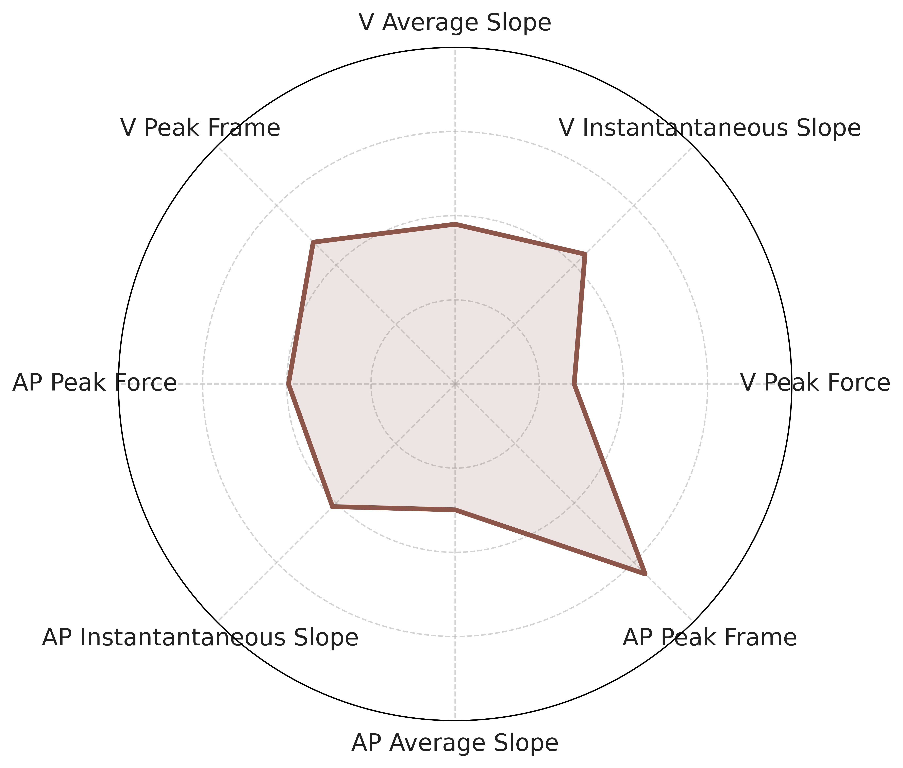

# A Cluster Analysis of Ground Reaction Forces

## Table of Contents

1. [Introduction](#introduction)
2. [Methods](#methods)
3. [Results](#results)
4. [Acknowledgements](#acknowledgements)
5. [References](#references)

## Introduction

Foot strike patterns, a fundamental aspect of running, play a role in determining injury risk, performance, and footwear design (Gruber et al., 2013; Hasegawa et al., 2007; Lieberman et al., 2010). Historically, runners have been classified into three foot strike categories: rearfoot strike (RFS), midfoot strike (MFS), and forefoot strike (FFS) from the foundational work of Cavanaugh & La Fortune (1980). More recently, kinematic methods have been used for such classification (Altman & Davis, 2012).  However, recent advances in machine learning (ML) suggest that a comprehensive, data-driven classification system could capture a continuous spectrum of foot strike behaviors, thereby offering deeper insight into biomechanical function during ground contact in stance which may have implications on mechanisms underlying injuries (Ferber et al., 2016; Halilaj et al., 2018; Leporace et al., 2025; Martin et al., 2022).

Ground reaction force (GRF) data, particularly focusing on its vertical and anterior-posterior components, provide quantitative information on the dynamic interaction between the foot and ground during running. GRFs illustrate key events during stance, such as the presence or absence of an impact transient, variations in loading rate, and the timing of peak force, which are influenced by the runner's foot strike pattern (Gruber et al., 2017). For example, runners categorized as rearfoot strikers typically exhibit a pronounced impact transient in vertical GRF early in stance while forefoot strikers present a much smoother force-time curve, having a delayed or even absent vertical impact peak during the first 25% of stance coupled with a reduced loading rate (Almeida et al., 2015; Lieberman et al., 2010). These observed differences suggest that GRF’s can serve as powerful and high-resolution indicators for identifying and categorizing foot strike patterns.

Recent studies have suggested that three categories of foot strike patterns may not adequately capture all salient features of GRFs (Stiffler-Joachim et al., 2019). Other GRF components such as AP forces (Boyer et al., 2014) and high-frequency characteristics of the GRF signal (Gruber et al., 2017) may also have implications on tissue loading that may go unappreciated when traditional labels are used to classify foot strike pattern (Malisoux et al., 2021). 

ML techniques and unsupervised clustering methodologies offer the potential for automated classification of these data, circumventing the necessity for predetermined labels (Ferber et al., 2016; Jauhiainen et al., 2020; Mahoney et al., 2024; Martin et al., 2022). By employing techniques to cluster GRF waveforms, researchers can uncover naturally occurring patterns, potentially identifying previously unrecognized subtypes of foot strike behavior. This innovative approach not only enables scalable and objective analysis across extensive datasets but is also particularly valuable in both research and practical application within sports and clinical research.

The primary aim of this study was to explore the use of ML techniques to identify latent biomechanical groupings in GRFs that extend beyond tradtional foot strike classifications. Using large-scale feature extraction, dimensionality-reduction, and unsuperived clustering methods, we sought to determine whether distinct data-driven categories of running mechanics emerge from GRFs alone and how these groupings relate to labels derived form conventional kinematic classificiton methods. Ultimately, this investigation seeks to refine the precision and applicability of foot strike analysis using GRF data through sophisticated, data-driven methods that enhance our understanding of running biomechanics and its implications for injury prevention and performance optimization.

## Methods

#### *Participants*

This was a sub-analysis of an ongoing prospective trial of NCAA Division III Cross-country athletes. Incoming athletes were invited to participate during their first season from 2016-2023. Exclusion criteria included lower extremity surgery (last 12 months), current injury, or any condition precluding participation in running. Each provided informed consent to participate using a protocol approved by the university institutional review board.

#### *Procedures*

Overground running trials were collected on a 19.8 m runway using a force plate mounted flush with the surface. Several warm-up trials were allowed at each runner’s self-reported training pace. Running speed was monitored using photoelectric timing gates with a 2 m span centered on the plate to ensure that each trial was collected within ±5% of the participant’s training pace. Five trials were collected for each limb. Successful trials had the foot entirely on the force plate, no plate “targeting” was observed, and had a speed within the desired range.

#### *Cluster Analysis*

Ground reaction force (GRF) from the left and right foot strikes were processed and analyzed seperatley. A fourier filter was used to decompose the vertical (V) and anterior-posterior (AP) force signals into low- and high-frequency components using a 10 Hz cutoff. Features were extracted using the TSFRESH Python package. Zero variance features were removed, and remaining features were normalized. Principle Component Analysis (PCA) was then applied, retaining PCs that accounted for 90% of total variance. Finally, Hierarchical Agglomerative Clustering (HAC) was performed to partition the dataset into 5 clusters using Ward linkage and the Euclidean distance metric.

#### *Interpretation and Comparison of Clusters*

Running profiles were defined based on clusters formed through HAC, and their charecteristics were compared using spider charts of externally selected biomechanically relevant GRF features, standardized to the percentile of it's mean.

To assess whether these GRF-based groupings aligned with labels formed from kinematic methods, a confusion matrix compared cluster assignments with foot strike labels using from .

To idenifity which of the TSFRESH-derived time-series features contributed most strongly to the formation of clusters beyond the traditional RFS, MFS, and FFS categorization, a Laplacian Score-based ranking was applied to the full feature matrix. This unsupervised criteerion evalues the extent to which each feature preseres local structure in the dataset and therefore highlights variables that meaningfully contribute to cluster formation.

## Results

1979 non-zero variance features were extracted from the V and AP componetns of the GRF data and 1981 non-zero variance features from the left GRF data.
For both the left and right GRF features the first 52 principle components, expalining 90% of the total variance, were chosen as input for the HAC algorithm for both right and left foot strikes. The dendogram for the clustering results are outlined in Figure 1.

<table align="center">
  <tr>
    <td align="center"> <em>Cluster 4 Running Profile</em></td>
    <td align="center"> <em>Cluster 5 Running Profile</em></td>
  </tr>
</table>

#### *Foot Strike Cluster Profiles*

Spider plots for the five right-foot strike clusters (Figure 1) visualize how each group differs across a set of externally selected, biomechanically meaningful GRF features associated with running-related injury risk. Each of the five clusters demonstrates a unique biomechanical running profile, indicating that the clusters formed caputer meaningful differences in how athletes load and interact with the ground during stance beyond the traditional RFS, MFS, and FFS categorizations.

<table align="center">
  <tr>
    <td align="center"> <em>Cluster 1 Running Profile</em></td>
    <td align="center"> <em>Cluster 2 Running Profile</em></td>
    <td align="center"> <em>Cluster 3 Running Profile</em></td>
  </tr>
  <tr>
    <td align="center"> <em>Cluster 4 Running Profile</em></td>
    <td align="center"> <em>Cluster 5 Running Profile</em></td>
  </tr>
</table>

_**Figure 2**. Spider plots illustrating the biomechanical running profiles for the five right-foot strike clusters._

The left-foot clusters displayed feature distributions that closely matched those identified in the right-foot analysis, suggesting that the same underlying biomechanical running strategies emerged regardless of limb.

<table align="center">
  <tr>
    <td align="center"> <em>Cluster 1 Running Profile</em></td>
    <td align="center"> <em>Cluster 2 Running Profile</em></td>
    <td align="center"> <em>Cluster 3 Running Profile</em></td>
  </tr>
  <tr>
    <td align="center"> <em>Cluster 4 Running Profile</em></td>
    <td align="center"> <em>Cluster 5 Running Profile</em></td>
  </tr>
</table>

_**Figure 3**. Spider plots illustrating the biomechanical running profiles for the five left-foot strike clusters._

#### *Relationship Between Data-Driven Clsuters and Kinematic Foot Stirek Pattern*

The confusion matirx shown in Figure compares right 

<table align="center">
  <tr>
    <td align="center"> <em>Right</em></td>
    <td align="center"> <em>Cluster 2</em></td>
  </tr>
</table>

## Acknowledgements

I would like to thank Dr. Song Chen, Dr. Thomas Kernozek, Dr. Nathan Vannetta, and Dr. Drew Rutherford for the opportunity to contibribute to this project.

## References

1.  Almeida, M. O., Davis, I. S., & Lopes, A. D. (2015). Biomechanical Differences of Foot-Strike Patterns during Running: A Systematic Review with meta-analysis. Journal of Orthopaedic and Sports Physical Therapy, 45(10), 738–755. https://doi.org/10.2519/jospt.2015.6019.
